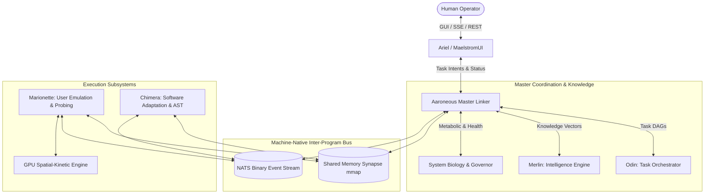

# 02: System Architecture Blueprint

## High-Level Architecture Overview

Aaroneous is designed around a decoupled, multi-program topology where independent executables communicate over high-speed local IPC, shared memory memory-mapped regions, and high-performance NATS binary streams.

---

## The Four Core Architectural Layers

### 1. Presentation & Human Interface Layer (Ariel / MaelstromUI)
- **Technology**: Tauri 2.0 + React 18 + TypeScript + Vite + Tailwind CSS.
- **Role**: Communicates with the Aaroneous Master daemon via Server-Sent Events (SSE) and HTTP REST.
- **Responsibilities**:
  - Command Center: Intent submission, DAG visualization, real-time agent output feed.
  - SAB Arsenal: Visualization of available sovereign modules and specialists.
  - Agentic Ops: Macro recording, routine playback management, and scheduled tasks.
  - Telemetry: Real-time FPS, GPU compute latency, thermal metrics, token reserves.

### 2. Orchestration & Intelligence Layer (Aaroneous Master, Odin, Merlin)
- **Aaroneous Master**: The daemon hosting the central event loop, metabolic governor, and inter-program linker.
- **Odin (Task Management)**:
  - Generates multi-step execution plans (`ExecutivePlan`).
  - Tracks step status (`Pending`, `InProgress`, `Completed`, `Failed`).
  - Manages token consumption and risk scores using historical episodic memory.
- **Merlin (Knowledge & Semantic Index)**:
  - SQLite (`hive.db` / `hox.db`) and in-memory vector index.
  - Stores high-dimensional semantic embeddings (1024-float vectors) for lightning-fast retrieval.

### 3. Execution & Emulation Layer (Marionette & Spatial-Kinetic Reflex)
- **Marionette Core**:
  - Handles screen ingestion (128x128 normalized float grids).
  - Evaluates epigenetic gating matrices (256 sectors) to isolate areas of interest.
  - Passes visual grids into GPU WGSL compute shaders (`reflex_kernel.wgsl`).
  - Translates GPU activation vectors into motor intents (mouse movement, click, key presses).
  - **Safety Enclosure**: Strictly isolated behind dry-run and `--no-hid` flags during testing.

### 4. Software Adaptation Layer (Chimera)
- **Decompilation & Bytecode Slicing**: Ingests raw binaries and formats them into clean intermediate representations.
- **AST Synthesis**: Uses tree-sitter to parse source files, detect syntax/semantic flaws, and generate non-destructive patches.
- **Sandbox Testing**: Validates candidate code changes in an isolated build sandbox prior to promoting changes to live modules.

---

## Inter-Program Communication Substrates

| Substrate | Latency | Throughput | Use Case |
| :--- | :--- | :--- | :--- |
| **Shared Memory Synapse (`.synapse` mmap)** | < 1 µs | Multi-GB/s | Real-time state synchronization, sensory grid sharing, reflex motor intents. |
| **NATS Binary Event Stream** | 50–200 µs | High | Event notifications, specialist task dispatch, consensus voting, telemetry broadcast. |
| **REST / SSE API (Port 8765)** | 1–5 ms | Moderate | Human-facing UI communication (MaelstromUI ➔ Aaroneous Core). |
