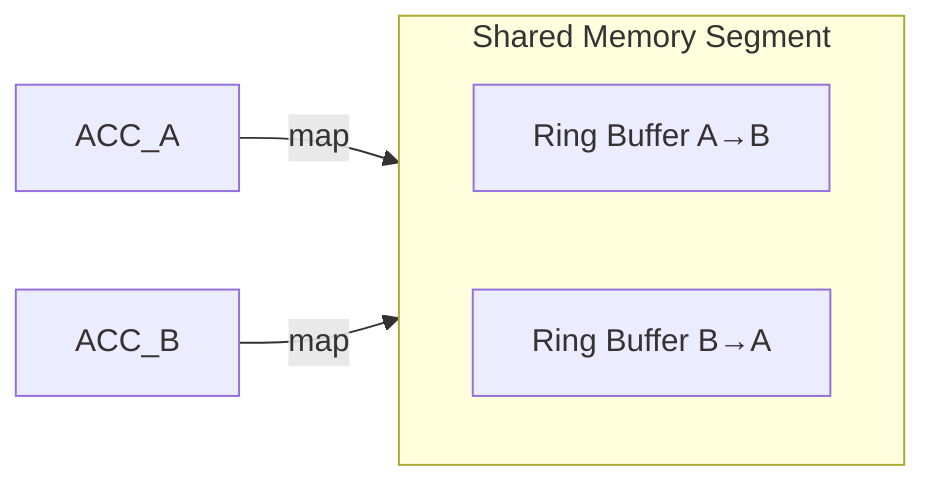

# Zero‑Copy Inter‑ACC Ring Buffer Specification

**Version:** v1.2.0 (Aaroneous Framework)

---

## 1. Objective
Define a lock‑free shared‑memory communication layer that enables independent Cratify ACC microkernel components to exchange structured data with **zero‑copy** overhead while respecting the isolation guarantee `max_blast_radius = "isolated"`.

---

## 2. High‑Level Architecture
- Each ACC runs in its own sandboxed microkernel tier (process or job object).  A **shared memory segment** is created by the hypervisor (`CapabilityBroker`) and mapped read‑write into the address space of the participating ACCs.
- The segment contains a **ring buffer** (`Disruptor`‑style) for each direction of communication (A→B, B→A).  The buffer stores **packets** composed of a fixed‑size header (`IpcHeader`) followed by a payload of a `bytemuck::Pod` type.
- Ownership of the buffer is **uni‑directional**: the producer writes, the consumer reads.  After a consumer processes a packet it calls `release()` which advances the consumer cursor, allowing the producer to reuse the slot.

---

## 3. Data Layout


### 3.1 Packet Header (`IpcHeader`)
```rust
#[repr(C)]
#[derive(Clone, Copy, Debug, Pod, Zeroable)]
pub struct IpcHeader {
    /// Destination ACC identifier (32‑bit).
    pub dst: u32,
    /// Source ACC identifier (32‑bit).
    pub src: u32,
    /// Length of the payload in bytes (excluding header).
    pub len: u32,
    /// Optional flags for error tracking.
    pub flags: u32,
}
```
- `flags` bits include `ERROR`, `OVERFLOW`, `RESERVED`.
- Header size is 16 bytes, guaranteeing 8‑byte alignment for all POD payloads.

### 3.2 Payload Alignment
- All payload structs must derive `bytemuck::Pod` and be annotated with `#[repr(C)]` (or `#[repr(packed)]` when necessary).
- The ring buffer enforces **slot size** = `max_payload_size` (configurable, default 4 KB).  Payloads smaller than the slot are zero‑padded.
- Because the buffer is a contiguous memory region, a payload can be accessed directly via a slice:
  ```rust
  let payload: &[T] = unsafe { bytemuck::cast_slice(&buffer[slot_offset..]) };
  ```

---

## 4. Ownership & Lifetime Safety
1. **Producer‑Only Write** – Only the owning ACC may write to its producer cursor.  The cursor is stored in a `AtomicUsize` in the shared segment.
2. **Consumer‑Only Read** – The consumer reads from a separate `AtomicUsize` cursor.  The consumer must **release** the slot before the producer can overwrite it.
3. **Memory‑Safety Guarantees**
   - The ring buffer never exposes mutable references to the same memory region concurrently; all access is through `&[u8]` slices and `AtomicUsize` counters.
   - When an ACC terminates, the hypervisor clears its cursors and invalidates the segment for that direction, preventing use‑after‑free.

---

## 5. Synchronization Primitives
- **AtomicPaddedUsize** – 64‑bit atomics aligned to a cache line to avoid false sharing.
- **Spin‑wait with back‑off** – Producers spin on `available_slots()`; if the buffer is full they yield (`std::thread::yield_now`) and retry, guaranteeing lock‑free progress.
- **Memory fences** – `atomic::fence(Ordering::Release)` after writing a payload; `atomic::fence(Ordering::Acquire)` before reading.

---

## 6. Error Tracking & Recovery
| Flag | Meaning |
|------|---------|
| `0x1` | Payload size exceeds slot (packet dropped). |
| `0x2` | CRC mismatch (optional integrity check). |
| `0x4` | Consumer timeout – slot recycled without processing. |

When a flag is set, the consumer reports the event to the `CapabilityBroker`, which may place the offending ACC into a **quarantine tier** (`tier = "unverified"`).

---

## 7. Integration Points
- **`crates/core-contracts/src/lib.rs`** – defines `IpcHeader` and all shared POD structs; the ring buffer implementation lives in `crates/compute/src/burn_gpu.rs` (future GPU off‑load). 
- **`crates/cratify/src/translate.rs`** – after `cratify translate`, the generated ACC binary links against `libinter_acc_ring_buffer.a` and registers its endpoints with the hypervisor.
- **`@hypervisor`** – creates the shared memory region via `CreateFileMapping` / `MapViewOfFile` (Windows) or `mmap` (POSIX) under the `max_blast_radius` isolation policy.

---

## 8. Future Extensions
- **Multi‑producer / Multi‑consumer** support via per‑ACC slot partitions.
- **GPU‑direct ring buffers** for high‑throughput vision pipelines.
- **Dynamic slot resizing** based on runtime profiling from the `EngineStatePublisher`.

---

*This specification provides the foundation for zero‑copy inter‑ACC communication required for phases 7‑9 of the Aaroneous roadmap.*
